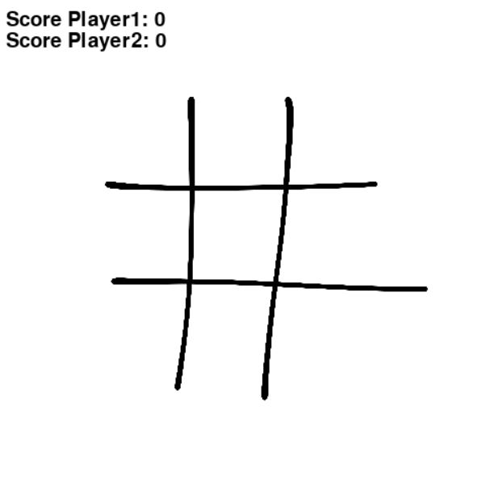
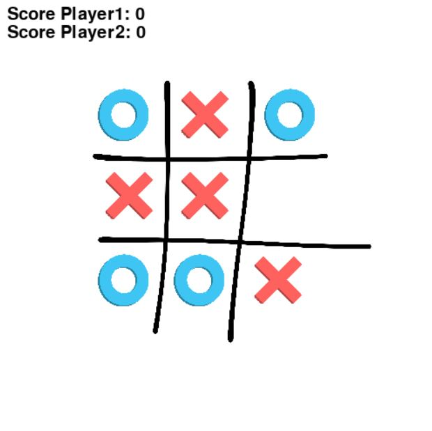
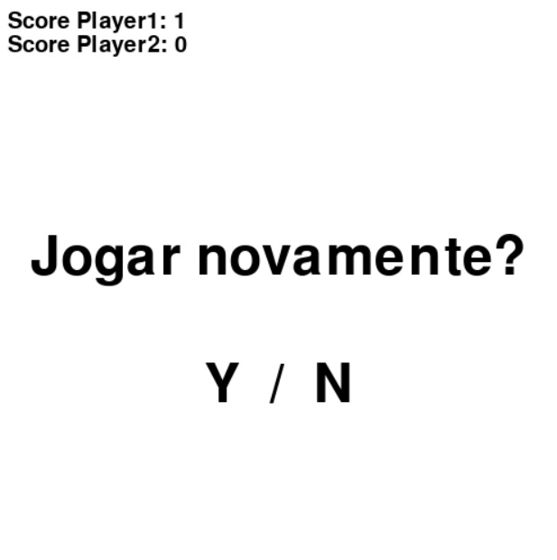

# PyTicTacToe

PyTTT is a Tic Tac Toe game made with Python's Pygame module. It has a simple UI and all features of the worldwide known game.

## Some exemples of the game running

  
  

  
  

## Installing
To play this game yourself is really simple. 

Firstly, make sure you have a Python 3 version installed and the Pygame Module.

Then, just run the command to clone this repo:

git clone https://github.com/BrunoPDRS/PyTicTacToe.git

## Running the app
After cloning the project, just open the terminal on the folder where it is located and run the python command on the file 'unbeatable.py'.
